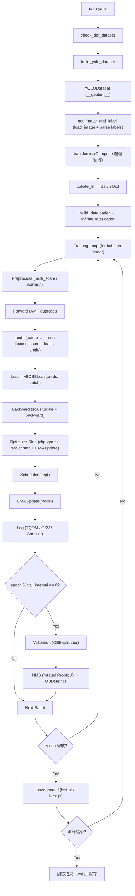

# YOLO11-OBB 遥感车辆检测 — 系统架构说明书

> **版本**: 8.4.80 | **硬件**: 8×A100 40GB | **PyTorch**: 2.11 | **生成日期**: 2026-06-28

---

## 目录

1. [项目概览](#一项目概览)
2. [系统整体流程](#二系统整体流程)
3. [系统输入](#三系统输入)
4. [DataLoader](#四dataloader)
5. [模型结构](#五模型结构)
6. [模型输入输出](#六模型输入输出)
7. [Loss](#七loss)
8. [Optimizer](#八optimizer)
9. [LR Scheduler](#九lr-scheduler)
10. [EMA](#十ema)
11. [Validation](#十一validation)
12. [Checkpoint](#十二checkpoint)
13. [训练循环](#十三训练循环)
14. [配置系统](#十四配置系统)
15. [日志系统](#十五日志系统)
16. [源码调用关系](#十六源码调用关系)
17. [扩展点](#十七扩展点)
18. [关键类索引](#十八关键类索引)
19. [关键函数索引](#十九关键函数索引)
20. [修改建议](#二十修改建议)

---

## 一、项目概览

### 1.1 项目用途

YOLO11-OBB 遥感车辆检测训练系统，针对**航拍/卫星遥感图像**中的车辆进行**旋转边界框（Oriented Bounding Box）检测**。支持 5 折交叉验证、P2 小目标检测层、多种 Loss 增强（Focal/ProbIoU/KLD Angle）及完整的 Profiling 诊断工具。

### 1.2 支持的任务

| 任务 | 类名前缀 | 说明 |
|------|----------|------|
| **OBB** (主) | `OBBTrainer/Validator/Predictor` | 旋转框检测（当前主力任务） |
| Detect | `DetectionTrainer/Validator/Predictor` | 标准水平框检测 |
| Segment | `SegmentationTrainer/Validator/Predictor` | 实例分割 |
| Pose | `PoseTrainer/Validator/Predictor` | 关键点检测 |
| Classify | `ClassificationTrainer/Validator/Predictor` | 图像分类 |
| Semantic | `SemanticSegmentationTrainer/Validator/Predictor` | 语义分割 |

### 1.3 工程目录结构

```
YOLOv11/
├── train.py                         # 🔑 项目训练入口（增强CLI、断点续训保护）
├── plot_metrics.py                  # 训练指标可视化
├── run.sh                           # 便捷启动脚本
├── CLAUDE.system.md                 # 📖 本文档
│
├── configs/                         # 预设配置
│   ├── baseline.yaml                #   Baseline: yolo11n-obb, imgsz=640
│   └── enhanced.yaml                #   Enhanced: yolo11n-obb-p2, imgsz=800
│
├── ultralytics_src/ultralytics/     # 核心框架（本地修改版）
│   ├── __init__.py                  #   __version__="8.4.80", 惰性导入模型类
│   ├── engine/                      #   引擎层
│   │   ├── trainer.py               #     BaseTrainer: 训练循环、Optimizer/EMA/Checkpoint
│   │   ├── validator.py             #     BaseValidator: 验证循环、指标计算
│   │   ├── predictor.py             #     BasePredictor: 推理循环
│   │   ├── model.py                 #     Model: 统一API（train/val/predict/export）
│   │   └── exporter.py              #     Exporter: 20+ 格式导出
│   ├── models/                      #   模型定义
│   │   ├── yolo/model.py            #     YOLO 类 + task_map 分发
│   │   └── yolo/obb/               #     OBB 任务特化
│   │       ├── train.py             #       OBBTrainer
│   │       ├── val.py               #       OBBValidator（ProbIoU、DOTA）
│   │       └── predict.py           #       OBBPredictor
│   ├── nn/                          #   神经网络
│   │   ├── tasks.py                 #     BaseModel/DetectionModel/OBBModel + parse_model
│   │   └── modules/                 #     网络模块
│   │       ├── head.py              #       Detect/OBB/Segment/Pose/Classify heads
│   │       ├── block.py             #       C2f/C3k2/SPPF/Bottleneck/DFL/Proto
│   │       └── conv.py              #       Conv/DWConv/RepConv/Concat
│   ├── data/                        #   数据管线
│   │   ├── base.py                  #     BaseDataset: 图像加载/缓存/矩形训练
│   │   ├── dataset.py               #     YOLODataset: OBB标签解析、collate_fn
│   │   ├── augment.py               #     增强: Mosaic/MixUp/RandomPerspective/HSV/Flip/Format
│   │   ├── build.py                 #     build_dataloader / build_yolo_dataset
│   │   └── utils.py                 #     数据工具: check_det_dataset, verify_image_label
│   ├── utils/                       #   工具
│   │   ├── loss.py                  #     v8OBBLoss/v8DetectionLoss/v8PoseLoss/...
│   │   ├── metrics.py               #     OBBMetrics/DetMetrics/probiou/bbox_iou
│   │   ├── tal.py                   #     TaskAlignedAssigner/RotatedTaskAlignedAssigner
│   │   ├── ops.py                   #     xywhr2xyxyxyxy/dist2rbox/scale_boxes/...
│   │   ├── dist.py                  #     DDP: generate_ddp_command/ddp_cleanup
│   │   ├── callbacks/base.py        #     回调: no-op (test 评估已移除, 训练后手动)
│   │   ├── torch_utils.py           #     ModelEMA/EarlyStopping/select_device/autocast
│   │   ├── checks.py                #     check_amp/check_imgsz/环境诊断
│   │   ├── autobatch.py             #     自动批次大小估算
│   │   ├── profile_loader.py        #     [项目新增] DataLoader Profiling 框架
│   │   └── __init__.py              #     RANK/LOCAL_RANK 全局变量、DEFAULT_CFG
│   └── cfg/__init__.py              #   配置系统: get_cfg/entrypoint
│
├── tools/                           # 独立工具
│   └── benchmark_dataloader.py      #   [新增] DataLoader 性能benchmark套件
│
├── dataset_yolo/                    # 5 Fold 数据集
│   ├── fold_0/data.yaml             #   train + val + test
│   ├── fold_1/data.yaml
│   ├── fold_2/data.yaml
│   ├── fold_3/data.yaml
│   └── fold_4/data.yaml
│
├── dataset/                         # 原始数据集
├── docs/experiment_notes.md         # 实验笔记
└── runs/                            # 训练输出
    └── enhanced_fold0_1000ep-10/    #   当前实验
```

---

## 二、系统整体流程



**逐步说明**:

| 步骤 | 描述 | 核心文件:函数 |
|------|------|--------------|
| 数据加载 | YAML → Dataset → DataLoader → Batch | `data/build.py:build_dataloader` |
| 增强 | Mosaic→CopyPaste→Perspective→MixUp→HSV→Flip→Format | `data/augment.py:v8_transforms` |
| 前向传播 | AMP autocast → model(batch) → head 输出 | `nn/tasks.py:BaseModel.forward` |
| Loss | TAL Assigner → ProbIoU + BCE/Focal + DFL + Angle | `utils/loss.py:v8OBBLoss.loss` |
| 反向传播 | scaler.scale(loss).backward() | `engine/trainer.py:optimizer_step` |
| 优化 | clip_grad → scaler.step → zero_grad | `engine/trainer.py:_do_train` |
| EMA | ema.update(model) 每个 optimizer step 后 | `utils/torch_utils.py:ModelEMA.update` |
| 验证 | OBBValidator: NMS(ProbIoU) → OBBMetrics | `models/yolo/obb/val.py:OBBValidator` |
| 保存 | last.pt (每epoch) + best.pt (最优) | `engine/trainer.py:save_model` |

---

## 三、系统输入

### 3.1 数据输入

#### Dataset YAML 格式

```yaml
# dataset_yolo/fold_0/data.yaml
path: .
train: train/images
val: val/images
test: ../test/images   # 5 fold 共享

names:
  0: small-vehicle
  1: large-vehicle
  ...
nc: 5
```

#### OBB 标签格式

**文件格式**: 每行 9 个归一化值 `class_id x1 y1 x2 y2 x3 y3 x4 y4`（4 个角点）

**内部格式**: 加载后转为 `[class_id, cx, cy, w, h, angle]`（5 参数 + 类别）

- 源码: `data/augment.py:2343` — `Format.apply_instances` 调用 `xyxyxyxy2xywhr()` 转换
- 转换函数: `utils/ops.py:346` — 用 `cv2.minAreaRect` 提取 `(cx, cy, w, h, theta)`

#### 数据进入模型流程

```
磁盘 JPEG
  → cv2.imread (BaseDataset.load_image, base.py:210)
  → resize to imgsz=800 (保持长宽比或拉伸)
  → Mosaic 4张图拼接 (augment.py:422)
  → RandomPerspective 旋转/缩放/平移 (augment.py:1036)
  → MixUp 混合 (augment.py:762)
  → RandomHSV 颜色抖动 (augment.py:1400)
  → RandomFlip 翻转 (augment.py:1477)
  → Format: np→torch, HWC→CHW, 归一化 [0,1] (augment.py:2187)
  → collate_fn: stack images, concat labels (dataset.py:285)
  → Batch {img, cls, bboxes, obb, batch_idx}
```

### 3.2 配置输入

| 配置来源 | 优先级 | 文件/位置 |
|----------|--------|-----------|
| `DEFAULT_CFG_DICT` | 最低（基础默认值） | `cfg/default.yaml` |
| Preset YAML | 中 | `configs/{enhanced,baseline}.yaml` |
| CLI 参数 | 最高（覆盖前面所有） | `train.py` CLI parser |

**配置流向**:
```
CLI args → train.py main() → get_enhanced_args(fold) → Model.train(**args)
  → Model._new/_load → BaseTrainer.__init__ → get_cfg(cfg, overrides)
  → IterableSimpleNamespace → self.args
```

核心配置类: `utils/__init__.py:682` — `DEFAULT_CFG = IterableSimpleNamespace(**DEFAULT_CFG_DICT)`

---

## 四、DataLoader

### 4.1 类层次

```
torch.utils.data.Dataset
  └── BaseDataset (data/base.py:23)
        └── YOLODataset (data/dataset.py:52)
              ├── GroundingDataset
              └── SemanticDataset

torch.utils.data.DataLoader
  └── InfiniteDataLoader (data/build.py:43)
```

### 4.2 `__getitem__` 完整流程

```
YOLODataset.__getitem__(index)                          base.py:395
  │
  ├── get_image_and_label(index)                        base.py:399
  │   ├── deepcopy(labels[index])
  │   ├── load_image(index)                             base.py:210
  │   │   ├── RAM缓存命中 → 立即返回
  │   │   ├── .npy 磁盘缓存命中 → np.load()
  │   │   └── 缓存未命中 → cv2.imread() → resize
  │   └── update_labels_info()                          dataset.py:252
  │       └── Instances(bboxes, segments, keypoints)
  │
  └── transforms(data)                                  Compose.__call__
      ├── Mosaic (p=1.0, 4张图拼合)                     augment.py:422
      ├── CopyPaste (p=0.0)                             augment.py:1853
      ├── RandomPerspective (旋转/缩放/平移/剪切)        augment.py:1036
      ├── MixUp (p=0.1, 图像混合)                       augment.py:762
      ├── CutMix (p=0.0)                                augment.py:863
      ├── Albumentations (模糊/CLAHE/对比度)             augment.py:2008
      ├── RandomHSV (h/s/v 抖动)                        augment.py:1400
      ├── RandomFlip vertical (p=0.0)                   augment.py:1477
      ├── RandomFlip horizontal (p=0.5)                 augment.py:1477
      └── Format (np→torch, HWC→CHW, OBB→xywhr)         augment.py:2187
```

### 4.3 增强参数默认值 (enhanced.yaml)

| 参数 | 值 | 作用 | 源码位置 |
|------|-----|------|----------|
| `mosaic` | 1.0 | Mosaic 概率 | `augment.py:2732` |
| `mosaic9` | 0.2 | 3x3 Mosaic (9 图) 概率 | 配置文件 |
| `mixup` | 0.1 | MixUp 混合概率 | `augment.py:2766` |
| `copy_paste` | 0.0 | 实例复制粘贴概率 | `augment.py:1853` |
| `degrees` | 0.0 | 最大旋转角度 | `augment.py:1073` |
| `translate` | 0.1 | 最大平移比例 | `augment.py:1074` |
| `scale` | 0.5 | 缩放范围 [0.5, 1.5] | `augment.py:1075` |
| `shear` | 0.0 | 最大剪切角度 | `augment.py:1076` |
| `perspective` | 0.0 | 透视变换概率 | `augment.py:1077` |
| `hsv_h/s/v` | 0.015/0.3/0.2 | HSV 颜色抖动 | `augment.py:1423` |
| `fliplr` | 0.5 | 水平翻转概率 | `augment.py:2770` |
| `close_mosaic` | 15 | epoch 16 起关闭 Mosaic | `dataset.py:240` |
| `multi_scale` | 0.1 | 输入尺寸 ±50% 随机变化 | `detect/train.py:107` |

### 4.4 DataLoader 参数

| 参数 | 值 | 说明 | 源码位置 |
|------|-----|------|----------|
| `batch` | 96 (12/GPU) | 总 batch size | `build.py:320` |
| `workers` | 24 | 每个进程的 worker 数 | `build.py:344` |
| `persistent_workers` | True | 跨 epoch 复用 worker | `build.py:317` |
| `prefetch_factor` | 4 | 预取因子 | `build.py:316` |
| `pin_memory` | True | 锁页内存加速 GPU 传输 | `build.py:318` |
| `drop_last` | True | 最后不完整 batch 丢弃 | `build.py:316` |

**Worker 数量公式** (`build.py:344`):
```python
nw = min(max(os.cpu_count() // max(nd, 1), workers // 2), workers)
# nd = GPU 数量
# 结果: min(max(80//8, 12), 24) = min(max(10, 12), 24) = min(12, 24) = 12/进程
```

### 4.5 缓存策略

| 模式 | 命令 | 内存占用 | 适用场景 |
|------|------|----------|----------|
| 无缓存 | 默认 | ~3GB (JPEG) | **DDP 推荐** |
| `cache=ram` | `--cache ram` | ~14GB | 单卡训练 |
| `cache=disk` | `--cache disk` | ~14GB 磁盘 | 多卡I/O受限 |

**⚠️ DDP 下禁止使用 `cache=ram`**: fork 8 个子进程导致 14GB×8=112GB RAM（copy-on-write 被实际触发），系统 OOM。

**⚠️ `cache=disk` 在 128 workers 下磁盘 I/O 争抢严重**: 8495 个 `.npy` 小文件随机读取，每 epoch 10-18 分钟 → 不使用磁盘缓存降至 40s/epoch。

---

## 五、模型结构

### 5.1 模型构建流程

```
YAML 配置文件
  ↓ yaml_model_load()                     nn/tasks.py:1964
parse_model(d, ch)                        nn/tasks.py:1761
  ├── 读取 scales {n: [0.33, 0.25, 1024]} 选型
  ├── 应用 depth_multiple / width_multiple 缩放
  ├── 遍历 backbone + head 条目
  │   ├── [from, number, module, args]
  │   ├── number = round(n * depth)
  │   ├── c2 = make_divisible(c2 * width, 8)
  │   └── 实例化 m(*args)
  └── 返回 nn.Sequential(*layers)
  ↓
DetectionModel.__init__()                 nn/tasks.py:344
  └── _initialize_yolo_model()
```

### 5.2 模型架构: Backbone → Neck → Head

```
Backbone (yolo11n-obb-p2.yaml):
  Conv(3→64, k=3, s=2)          # P1/2
  Conv(64→128, k=3, s=2)        # P2/4  ← P2 head 输入
  C3k2(128→256, n=2)            # P3/8
  Conv(256→256, k=3, s=2)
  C3k2(256→512, n=2)            # P4/16
  Conv(512→512, k=3, s=2)       # P5/32
  C3k2(512→512, n=2)
  SPPF(512→512)

Neck (PAN-FPN):
  P5: Upsample → Concat(P4) → C3k2
  P4: Upsample → Concat(P3) → C3k2
  P3: Conv → Concat → C3k2
  P2: Conv → Concat → C3k2     ← 仅 P2 模型

Head (Task-specific):
  OBB: Detect [P2, P3, P4, P5] → box + cls + angle
  每层: cv2(box: 4×16=64ch) + cv3(cls: nc) + cv4(angle: 1ch)
```

### 5.3 核心模块说明

| 模块 | 文件:类 | 行号 | 说明 |
|------|---------|------|------|
| `Conv` | `conv.py:Conv` | 39 | Conv2d + BatchNorm2d + SiLU |
| `C2f` | `block.py:C2f` | 288 | CSP Bottleneck with 2 convs |
| `C3k2` | `block.py:C3k2` | 1069 | **YOLO11 主力模块**: C2f 变体 (Bottleneck/C3k) |
| `SPPF` | `block.py:SPPF` | 208 | 3 个串联 MaxPool(k=5) |
| `Detect` | `head.py:Detect` | 37 | 基础检测头: box + cls |
| `OBB` | `head.py:OBB` | 428 | **旋转框检测头**: box + cls + angle |
| `Segment` | `head.py:Segment` | 265 | 分割头: box + cls + mask_coeff + proto |
| `Pose` | `head.py:Pose` | 558 | 姿态头: box + cls + keypoints |
| `DFL` | `block.py:DFL` | 58 | Distribution Focal Loss 层 |

### 5.4 模型缩放 (n/s/m/l/x)

```yaml
# yolo11n-obb-p2.yaml 中的 scales
scales:
  n: [0.50, 0.25, 1024]   # depth×0.5, width×0.25, max_ch=1024
  s: [0.50, 0.50, 1024]
  m: [0.50, 1.00, 512]
  l: [1.00, 1.00, 512]
  x: [1.00, 1.50, 512]
```

`parse_model` 自动应用缩放 (`nn/tasks.py:1782-1786`):
- `n = max(round(n * depth_multiple), 1)` — 模块重复数缩放
- `c2 = make_divisible(min(c2, max_channels) * width_multiple, 8)` — 通道数缩放

### 5.5 Forward 流程

```python
# BaseModel.forward (nn/tasks.py:129)
def forward(self, x):
    if isinstance(x, dict):  # 训练模式
        return self.loss(x)
    else:                     # 推理模式
        return self.predict(x)

# _predict_once (nn/tasks.py:163)
for m in self.model:          # Sequential 逐层执行
    if m.f != -1:             # f = from 索引
        x = y[m.f] if isinstance(m.f, int) else [y[j] for j in m.f]
    x = m(x)                  # 执行该层
    y.append(x if m.i in self.save else None)
```

---

## 六、模型输入输出

### 6.1 模型输入

| 属性 | 值 |
|------|-----|
| Shape | `(batch, 3, 800, 800)` |
| dtype | FP16 (AMP) 或 FP32 |
| device | CUDA (A100) |
| 值域 | `[0, 1]` (BGR 归一化) |

### 6.2 模型输出 (训练模式)

```python
preds = {
    "boxes":  Tensor,         # shape: (batch, 4*reg_max, num_anchors)
    "scores": Tensor,         # shape: (batch, nc, num_anchors)
    "feats":  list[Tensor],   # 每层特征图
    "angle":  Tensor,         # shape: (batch, 1, num_anchors)  ← OBB 特有
}
```

### 6.3 模型输出 (推理模式)

```python
# OBB 输出: (batch, num_anchors, 4+nc+1)
detections[:, 0:4]   # bboxes (cx, cy, w, h, angle)
detections[:, 4]     # confidence
detections[:, 5:5+nc] # class scores
```

| 字段 | Shape | 含义 | 单位 | 范围 |
|------|-------|------|------|------|
| `cx, cy` | `(N, 2)` | 旋转框中心点 | 像素 | `[0, imgsz]` |
| `w, h` | `(N, 2)` | 旋转框宽高 | 像素 | `[0, imgsz]` |
| `angle` | `(N, 1)` | 旋转角度 | 弧度 | `[-π/4, 3π/4]` |
| `conf` | `(N, 1)` | 置信度 | — | `[0, 1]` |
| `cls_score` | `(N, nc)` | 类别分数 | — | `[0, 1]` |

---

## 七、Loss

### 7.1 Loss 组成

```
v8OBBLoss (utils/loss.py:986)
├── box_loss  (ProbIoU)        weight: hyp.box=7.5
├── cls_loss  (BCE or Focal)   weight: hyp.cls=0.5
├── dfl_loss  (Distribution Focal Loss) weight: hyp.dfl=1.5
└── angle_loss (sin²(2Δθ) or KLD) weight: hyp.angle=1.0
```

### 7.2 各 Loss 详解

#### Box Loss — ProbIoU (`utils/loss.py:232`, `utils/metrics.py:235`)

将旋转框建模为 2D 高斯分布，计算 Bhattacharyya 距离:

```
a, b, c = _get_covariance_matrix(box)    # 协方差分量
                                         # w2=w²/12, h2=h²/12
                                         # a=w2*cos²θ+h2*sin²θ
                                         # b=w2*sin²θ+h2*cos²θ
                                         # c=(w2-h2)*cosθ*sinθ
bd = 1/4 * ((a1+a2)(y1-y2)²+(b1+b2)(x1-x2)²) / ((a1+a2)(b1+b2)-(c1+c2)²)
   + 1/2 * (c1+c2)(x2-x1)(y1-y2) / ((a1+a2)(b1+b2)-(c1+c2)²)
   + 1/2 * log(((a1+a2)(b1+b2)-(c1+c2)²) / (4*√(a1*b1-c1²)*√(a2*b2-c2²)))
hd = √(1 - exp(-bd))
IoU = 1 - hd

loss_iou = sum((1 - probiou(pred, target)) * weight) / target_scores_sum
```

#### Classification Loss — BCE (`utils/loss.py:1090`)

```python
loss_cls = BCEWithLogitsLoss(pred_scores, target_scores, reduction="none").sum(-1)
loss_cls = (loss_cls * weight).sum() / target_scores_sum
```

可选 Focal Loss (`use_focal=True`, `loss.py:1099`):
```python
p_t = label * sigmoid(pred) + (1-label) * (1-sigmoid(pred))
loss = BCE(pred, label) * (1-p_t)^gamma * alpha_factor
```

目标分数 (`target_scores`) 经 TaskAlignedAssigner 归一化后直接作为 BCE 目标（非 one-hot）。

#### DFL — Distribution Focal Loss (`utils/loss.py:97`)

```python
# reg_max = 16, 预测 16 个 bin 的概率分布
target = clamp(target, 0, reg_max - 1.01)   # 框坐标目标
tl, tr = floor(target), tl + 1              # 左右整数 bin
loss = CE(pred_dist, tl)*(tr-target) + CE(pred_dist, tr)*(target-tl)
loss = mean(loss)
```

#### Angle Loss — sin²(2Δθ) (`utils/loss.py:1176`)

```python
log_ar = log(w_gt / h_gt)                     # 长宽比对数
scale_weight = exp(-log_ar² / 9)              # 越接近正方形权重越低
delta_theta = theta_pred - theta_gt
delta_theta_wrapped = delta_theta - round(delta_theta/pi) * pi   # 包装到 [-π/2, π/2]
ang_loss = sin(2 * delta_theta_wrapped)² * scale_weight
```

#### KLD Angle Loss (可选, `use_kld_angle=True`, `loss.py:1197`)

将旋转框建模为 2D 高斯，计算 KL 散度:

```
trace = (a_p*b_t + b_p*a_t - 2*c_p*c_t) / det_t
center_dist = ...  # 中心距离
log_term = log(det_t / det_p)
kld = 0.5 * (trace + center_dist - 2 + log_term)
kld_loss = √(1 + kld²/tau²) - 1
```

### 7.3 TaskAlignedAssigner (`utils/tal.py`)

**RotatedTaskAlignedAssigner** (`tal.py:359`): OBB 版本的标签分配器。

```
1. select_candidates_in_gts():  检查锚点中心是否在旋转GT框内（点积测试）
2. get_box_metrics():           计算对齐度量
   align_metric = bbox_scores^α × overlaps^β
   其中 α=0.5, β=6.0, overlaps = ProbIoU(gt, pred)
3. select_topk_candidates():    每个 GT 选 top-k 最对齐的锚点
4. select_highest_overlaps():   解决锚点-GT多对一冲突
5. get_targets():               生成 target_bboxes, target_scores, fg_mask
```

**关键**: P2+800 分辨率下锚点数 ~319K，GT 数量大时 CUDA OOM → 自动回退 CPU 计算 (`tal.py:62`)。

### 7.4 可选增强特性

| 特性 | 开关 | 源码 | 作用 |
|------|------|------|------|
| Focal Loss | `use_focal` | `loss.py:1099` | 聚焦难样本分类 |
| Wise-IoU | `use_wise_iou` | `loss.py:1126` | 离群值抑制的 IoU 损失 |
| KLD Angle | `use_kld_angle` | `loss.py:1140` | KL 散度角度回归 |
| Slide Loss | `use_slide_loss` | `loss.py:1106` | 中难样本自适应权重 |
| Scale-aware | `use_scale_aware` | `loss.py:1115` | 小目标高权重 |

---

## 八、Optimizer

### 8.1 支持的优化器

| 名称 | 说明 | 源码 |
|------|------|------|
| `auto` | 自动选择 (iter > 10000 → MuSGD, 否则 AdamW) | `engine/trainer.py:1104` |
| `SGD` | 带动量的 SGD | `engine/trainer.py:1139` |
| `Adam` | Adam | `engine/trainer.py:1137` |
| `AdamW` | Adam + 解耦 weight decay | `engine/trainer.py:1136` |
| `NAdam` | Nesterov Adam | `engine/trainer.py:1140` |
| `RAdam` | Rectified Adam | `engine/trainer.py:1141` |
| `RMSProp` | RMSProp | `engine/trainer.py:1142` |
| `MuSGD` | SGD + Muon (ndim≥2 的参数用 Muon) | `engine/trainer.py:1138` |

### 8.2 参数分组

```python
# engine/trainer.py:1109-1134
g[0]: weight (with decay)     # BN 权重、Conv 权重等
g[1]: weight (no decay)       # BN bias、logit_scale
g[2]: bias (no decay)         # Conv bias、BN running_mean/var
g[3]: MuSGD only: ndim>=2 parameters → muon optimizer
```

### 8.3 当前配置

```yaml
optimizer: auto   # → AdamW (iter=~70K per 1000 epochs)
lr0: 0.01         # 初始学习率
momentum: 0.937   # SGD 动量 (AdamW 使用 betas=(0.937, 0.999))
weight_decay: 0.0005
```

优化器创建位置: `engine/trainer.py:1094` — `build_optimizer(self, model, name, lr, momentum, decay, iterations)`

梯度裁剪: `max_norm=10.0` (`engine/trainer.py:849`)

---

## 九、LR Scheduler

### 9.1 支持类型

| 类型 | 公式 | 源码 |
|------|------|------|
| Cosine (`cos_lr=true`) | `one_cycle(1, lrf, epochs)` → `LambdaLR` | `engine/trainer.py:251` |
| Linear (`cos_lr=false`) | `λ(x) = max(1 - x/epochs, 0) * (1-lrf) + lrf` | `engine/trainer.py:253` |

### 9.2 Warmup 流程

```python
# engine/trainer.py:447-462 (per batch)
if ni <= nw:  # nw = warmup_epochs * nb
    xi = [0, nw]  # warmup 区间
    accumulate = max(1, np.interp(ni, xi, [1, nbs/batch_size]))
    for j, x in enumerate(optimizer.param_groups):
        x["lr"] = np.interp(ni, xi, [0, x["initial_lr"] * lrf, x["initial_lr"]])
        if "momentum" in x:
            x["momentum"] = np.interp(ni, xi, [0.9, momentum])
```

Warmup 配置: `warmup_epochs=3.0`, `warmup_momentum=0.8`

### 9.3 Scheduler 更新

```python
# engine/trainer.py:429 (每个 epoch 开始时)
self.scheduler.step()
```

---

## 十、EMA

### 10.1 ModelEMA 实现

```python
# utils/torch_utils.py:647
class ModelEMA:
    def __init__(self, model, decay=0.9999, tau=2000, updates=0):
        self.ema = deepcopy(de_parallel(model)).eval()  # 影子模型
        self.decay = lambda x: decay * (1 - exp(-x / tau))  # 动态衰减
        # 跳过 DFL/Proto 参数 (不需要 EMA)

    def update(self, model):
        # 每个 optimizer step 后调用
        d = self.decay(self.updates)
        for ema_v, model_v in zip(self.ema.state_dict().values(), model.state_dict().values()):
            if model_v.dtype.is_floating_point:
                ema_v.mul_(d).add_(model_v.detach(), alpha=1-d)
        self.updates += 1
```

### 10.2 EMA 生命周期

| 阶段 | 操作 | 源码 |
|------|------|------|
| 创建 | `_setup_train()` 中 `ModelEMA(self.model)` | `engine/trainer.py:377` |
| 更新 | 每个 optimizer step 后 `ema.update(model)` | `engine/trainer.py:844` |
| 验证前 | DDP 同步 EMA 缓冲区 `dist.broadcast` | `engine/trainer.py:859` |
| 保存 | Checkpoint 保存 EMA 权重（非原始模型） | `engine/trainer.py:722` |
| 推理 | 使用 `ema.ema` (best.pt 含 EMA 权重) | — |

---

## 十一、Validation

### 11.1 验证流程

```
Validator.__call__(trainer, model)          engine/validator.py:143
  ├── 训练模式: 继承 trainer.device/data
  ├── model = trainer.ema.ema (EMA 影子模型)
  ├── model.eval(), half() conversion
  │
  ├── on_val_start 回调
  ├── init_metrics(unwrap_model(model))
  ├── for batch in dataloader:
  │   ├── on_val_batch_start
  │   ├── preprocess: batch → device, /255      detect/val.py:62
  │   ├── inference: preds = model(batch["img"])  engine/validator.py:240
  │   ├── loss: model.loss(batch, preds)          engine/validator.py:244
  │   ├── postprocess: NMS + angle concat         obb/val.py:97
  │   ├── update_metrics(preds, batch)            detect/val.py:169
  │   └── on_val_batch_end
  │
  ├── stats = get_stats()                    detect/val.py:235
  ├── finalize_metrics()
  ├── print_results()
  ├── DDP: dist.reduce(loss, dst=0, AVG)
  └── on_val_end 回调
```

### 11.2 OBB 特有处理

| 步骤 | Standard Detection | OBB |
|------|-------------------|-----|
| NMS IoU | `box_iou` (axis-aligned) | `batch_probiou` (rotated) |
| Metrics | `DetMetrics` | `OBBMetrics` |
| Confusion Matrix | `task="detect"` | `task="obb"` |
| JSON 导出 | xyxy2xywh | xywhr2xyxyxyxy (8 角点) |
| DOTA 评估 | 不支持 | ✅ `eval_json` 自动合并分块预测 |

### 11.3 指标计算

```python
# OBBMetrics 继承 DetMetrics (utils/metrics.py:1645)
# 与标准检测相同，仅 IoU 计算使用 probiou

# AP 计算 (utils/metrics.py:756)
compute_ap(recall, precision)
  → 101 点插值 AP (COCO 风格)
  → 对 10 个 IoU 阈值 [0.5:0.95:0.05] 取平均

# 输出指标
metrics/mAP50(B)      # mAP @ IoU=0.5
metrics/mAP50-95(B)   # mAP @ IoU=0.5:0.95
metrics/precision(B)  # 精确率
metrics/recall(B)     # 召回率
```

### 11.4 NMS 详解

```python
# detect/val.py:106, detect/predict.py:33
nms(boxes, scores, iou_thres, rotated=True)  # OBB 使用 ProbIoU NMS
```

对 OBB: 使用 `batch_probiou()` 计算旋转框间的重叠度，标准 greedy NMS 流程相同。

---

## 十二、Checkpoint

### 12.1 保存内容

```python
# engine/trainer.py:717 save_model()
checkpoint = {
    "epoch": int,                    # 当前 epoch
    "best_fitness": float,           # 最佳适应度
    "model": None,                   # 始终为 None
    "ema": ema.state_dict(),         # EMA 影子模型 (FP16)
    "updates": int,                  # EMA 更新次数
    "optimizer": optimizer.state_dict(),  # 优化器状态 (FP16)
    "scaler": scaler.state_dict(),   # GradScaler 状态
    "train_args": dict,              # 训练配置
    "train_metrics": dict,           # 当前指标
    "train_results": dict,           # CSV 内容
    "date": ISO8601,                 # 保存时间
    "version": "8.4.80",             # Ultralytics 版本
    "git": {...},                    # Git commit 信息
}
```

### 12.2 文件类型

| 文件 | 触发条件 | 用途 |
|------|----------|------|
| `last.pt` | 每 epoch 保存 | 断点续训 |
| `best.pt` | 当 `fitness > best_fitness` | 最佳模型（推理用） |
| `epoch{N}.pt` | `save_period > 0` 且 `epoch % save_period == 0` | 中间检查点 |

### 12.3 断点续训

```python
# train.py:234 (项目增强版)
if has_optimizer:
    # 完整 checkpoint: 续训（恢复 optimizer/epoch/EMA）
    model = YOLO(last_pt)
    args["resume"] = True
    args["exist_ok"] = True
else:
    # 只有权重: 加载权重重新训练
    model = YOLO(last_pt)
    args["resume"] = False
```

恢复时 (`engine/trainer.py:1061`):
1. 加载 epoch、best_fitness
2. 恢复 optimizer state_dict
3. 恢复 scaler state_dict
4. 重建 ModelEMA 并加载状态
5. 如果当前 epoch > close_mosaic → 关闭 mosaic

---

## 十三、训练循环

### 13.1 完整 Epoch 流程

```
Epoch Start
  ├── scheduler.step()                             trainer.py:429
  ├── model.train()                                trainer.py:431
  ├── if epoch >= close_mosaic:
  │     _close_dataloader_mosaic()                 trainer.py:437
  │     train_loader.reset()                       trainer.py:438
  │
  └── for batch in train_loader:                   trainer.py:444
      ├── on_train_batch_start                      trainer.py:445
      ├── warmup (lr/momentum 线性插值)              trainer.py:447
      │
      ├── Forward:                                  trainer.py:471
      │   with autocast(amp):
      │     preds = model(batch)                    → head 输出
      │     loss = criterion(preds, batch)          → v8OBBLoss
      │
      ├── Backward:                                 trainer.py:503
      │   scaler.scale(loss).backward()
      │
      ├── if ni - last_opt_step >= accumulate:      trainer.py:536
      │   optimizer_step():                         trainer.py:837
      │     scaler.unscale_(optimizer)
      │     clip_grad_norm_(max_norm=10.0)
      │     scaler.step(optimizer)
      │     scaler.update()
      │     optimizer.zero_grad()
      │     ema.update(model)                       trainer.py:844
      │
      ├── log (TQDM: epoch, mem, loss, instances)   trainer.py:558
      └── on_train_batch_end                        trainer.py:579

Epoch End
  ├── on_train_epoch_end (no-op)                      base.py:52
  ├── validate() → OBBValidator.__call__()          trainer.py:599
  ├── save_metrics() → results.csv                  trainer.py:610
  ├── save_model() → last.pt / best.pt              trainer.py:616
  ├── on_fit_epoch_end                              trainer.py:633
  └── epoch += 1

Training End
  ├── final_eval(): best.pt val + test eval
  ├── plot_metrics()
  ├── on_train_end → no-op                            base.py:122
  └── teardown
```

### 13.2 源码定位速查

| 步骤 | 文件 | 函数/方法 | 行号 |
|------|------|-----------|------|
| 调度器更新 | `engine/trainer.py` | `_do_train` | 429 |
| 关闭 mosaic | `engine/trainer.py` | `_do_train` | 437 |
| warmup | `engine/trainer.py` | `_do_train` | 447 |
| 前向传播 | `engine/trainer.py` | `_do_train` | 471 |
| Loss 计算 | `utils/loss.py` | `v8OBBLoss.__call__` | 1058 |
| 反向传播 | `engine/trainer.py` | `_do_train` | 503 |
| 优化器步进 | `engine/trainer.py` | `optimizer_step` | 837 |
| EMA 更新 | `utils/torch_utils.py` | `ModelEMA.update` | 685 |
| 验证 | `engine/validator.py` | `BaseValidator.__call__` | 143 |
| 保存检查点 | `engine/trainer.py` | `save_model` | 717 |
| 早停检查 | `utils/torch_utils.py` | `EarlyStopping.__call__` | 930 |

### 13.3 DDP 特殊处理

1. **启动**: `BaseTrainer.train()` 检测 `world_size > 1` → 调用 `subprocess.run` 启动 DDP 子进程
2. **子进程**: `LOCAL_RANK` 环境变量区分各进程, 直接调用 `_do_train()`
3. **梯度同步**: `DistributedDataParallel` 包装 → 自动 all-reduce
4. **数据采样**: `DistributedSampler` + `set_epoch(epoch)` 确保每 epoch 不同 shuffle
5. **验证损失归约**: `dist.reduce(loss, dst=0, AVG)` (`engine/validator.py:264`)
6. **检查点保护**: `if RANK in {-1, 0}: save_model()` — 仅 rank 0 写文件

---

## 十四、配置系统

### 14.1 配置加载链

```
cfg/default.yaml (DEFAULT_CFG_DICT, 最低优先级)
    ↓
configs/{enhanced,baseline}.yaml (Preset)
    ↓
CLI arguments (最高优先级, 覆盖一切)
```

### 14.2 核心配置项

| 参数 | 默认值 | 作用 | 读取位置 |
|------|--------|------|----------|
| `epochs` | 500 | 训练 epoch 数 | `trainer.py:405` |
| `batch` | 96 | 总 batch size | `trainer.py:320` |
| `imgsz` | 800 | 输入图像尺寸 | `base.py:75` |
| `workers` | 24 | DataLoader worker 数 | `build.py:344` |
| `device` | `0,1,2,3,4,5,6,7` | GPU 设备 | `trainer.py:131` |
| `optimizer` | `auto` | 优化器类型 | `trainer.py:1094` |
| `lr0` | 0.01 | 初始学习率 | `trainer.py:1096` |
| `lrf` | 0.01 | 最终 LR 因子 | `trainer.py:251` |
| `momentum` | 0.937 | 动量 | `trainer.py:1097` |
| `weight_decay` | 0.0005 | 权重衰减 | `trainer.py:1098` |
| `warmup_epochs` | 3.0 | 预热 epoch 数 | `trainer.py:447` |
| `cos_lr` | true | 余弦 LR 调度 | `trainer.py:251` |
| `amp` | true | 自动混合精度 | `trainer.py:339` |
| `close_mosaic` | 15 | 关闭 mosaic 的 epoch | `dataset.py:240` |
| `multi_scale` | 0.1 | 多尺度训练概率 | `detect/train.py:107` |
| `mosaic` | 1.0 | Mosaic 概率 | `augment.py:2732` |
| `mixup` | 0.1 | MixUp 概率 | `augment.py:2766` |
| `mosaic9` | 0.2 | 3x3 Mosaic 概率 | `augment.py` via hyp |
| `cls_pw` | 0.5 | 类别均衡权重指数 | `loss.py:1027` |
| `box/cls/dfl/angle` | 7.5/0.5/1.5/1.0 | Loss 权重 | `loss.py:1151-1154` |
| `patience` | 100 | 早停 patience | `trainer.py:385` |
| `save_period` | -1 | 定期保存 (负值=关闭) | `trainer.py:732` |
| `fraction` | 1.0 | 训练数据比例 | `base.py:86` |
| `cache` | false | 图像缓存 (ram/disk) | `base.py:136` |
| `profile_loader` | false | Profiling 开关 | `trainer.py:398` |
| `use_focal` | false | Focal Loss 开关 | `loss.py:1008` |
| `use_wise_iou` | false | Wise-IoU 开关 | `loss.py:1015` |
| `use_kld_angle` | false | KLD Angle 开关 | `loss.py:1018` |
| `use_slide_loss` | false | Slide Loss 开关 | `loss.py:1021` |
| `use_scale_aware` | false | Scale-aware 开关 | `loss.py:1024` |

---

## 十五、日志系统

### 15.1 输出通道

| 通道 | 位置 | 说明 |
|------|------|------|
| Console (TQDM) | `engine/trainer.py:558` | 实时进度条: epoch, GPU mem, loss, instances, imgsz |
| CSV | `{save_dir}/results.csv` | 每 epoch 一行, 完整指标 |
| TensorBoard | `{save_dir}/` | 指标曲线可视化 |
| Weights & Biases | 集成回调 | 可选 (`wb.py` 回调) |

### 15.2 results.csv 格式

```csv
epoch,time,train/box_loss,train/cls_loss,train/dfl_loss,train/angle_loss,
metrics/precision(B),metrics/recall(B),metrics/mAP50(B),metrics/mAP50-95(B),
val/box_loss,val/cls_loss,val/dfl_loss,val/angle_loss,
lr/pg0,lr/pg1,lr/pg2,lr/pg3
```

### 15.3 Test 集评估

> ⚠️ **已移除训练内回调**: `_test_eval_epoch` / `_test_eval_best` 回调已删除，因为在 DDP 训练中触发验证会导致 GPU 死锁（训练进程占用 8 张 GPU，验证又尝试启动 8 个 DDP 子进程 = 资源冲突）。

**训练完成后手动评估**:
```bash
python -c "
from ultralytics import YOLO
model = YOLO('runs/xxx/weights/best.pt')
model.val(data='dataset_yolo/fold_0/data.yaml', split='test')
"

### 15.4 Profiling 日志 (按需)

```bash
python train.py --enhanced --profile-loader
```

输出: per-batch 阶段耗时、per-epoch CPU/GPU 时间占比、自动瓶颈诊断

---

## 十六、源码调用关系

### 16.1 模块依赖图

```
train.py ───────────────────────────────────────────┐
    │                                                │
    ▼                                                │
ultralytics.YOLO (engine/model.py)                   │
    │  task_map["obb"]                               │
    ├── OBBModel (nn/tasks.py)                       │
    ├── OBBTrainer (models/yolo/obb/train.py)        │
    │       └── BaseTrainer (engine/trainer.py)      │
    │             ├── build_dataset() → YOLODataset  │
    │             ├── build_dataloader() → InfiniteDL │
    │             ├── build_optimizer()               │
    │             ├── _setup_scheduler()              │
    │             ├── ModelEMA                        │
    │             ├── EarlyStopping                   │
    │             ├── validate() → OBBValidator       │
    │             └── save_model() → checkpoint .pt   │
    ├── OBBValidator (models/yolo/obb/val.py)        │
    │       └── BaseValidator (engine/validator.py)  │
    │             ├── preprocess / postprocess        │
    │             ├── batch_probiou (NMS)             │
    │             └── OBBMetrics                      │
    └── OBBPredictor (models/yolo/obb/predict.py)    │
            └── BasePredictor (engine/predictor.py)   │
```

### 16.2 关键调用链

```
# 训练启动
train.py:main()
  → YOLO(args["model"])                          engine/model.py:81
  → model.train(**args)                          engine/model.py:718
    → OBBTrainer.__init__()                      obb/train.py:34
    → BaseTrainer.train()                        engine/trainer.py:220
      → DDP: subprocess.run(ddp_cmd)
      → else: _do_train()                        engine/trainer.py:390

# Loss 计算
model(batch)
  → BaseModel.forward()                          nn/tasks.py:129
    → DetectionModel.loss()                      nn/tasks.py:396
      → v8OBBLoss(preds, batch)                  utils/loss.py:1058
        → RotatedTaskAlignedAssigner             utils/tal.py:359
        → RotatedBboxLoss (ProbIoU)              utils/loss.py:218
        → BCE / FocalLoss                        utils/loss.py:1090
        → DFLoss                                 utils/loss.py:97
        → calculate_angle_loss / _kld_angle_loss utils/loss.py:1176

# 验证
trainer.validate()
  → OBBValidator.__call__(trainer)               engine/validator.py:143
    → preprocess → inference → postprocess
    → batch_probiou() → match_predictions()
    → OBBMetrics.process() → ap_per_class()

# 推理
model.predict(source)
  → OBBPredictor.stream_inference()              engine/predictor.py:279
    → preprocess → inference → postprocess(NMS)
    → construct_result(xywhr format)
```

---

## 十七、扩展点

### 17.1 新 Loss

**改哪里**: `utils/loss.py` — `v8OBBLoss` 类

```python
# 步骤:
# 1. 在 v8OBBLoss.__init__ 添加控制开关 (line 993)
# 2. 在 v8OBBLoss.loss() 中调用新 loss (line 1047)
# 3. 在 OBBTrainer.get_validator 的 loss_names 添加条目 (obb/train.py:77)
# 4. 在 enhanced.yaml 添加参数
```

### 17.2 新 Head

**改哪里**: `nn/modules/head.py` + `nn/tasks.py`

```python
# 1. 创建新 Head 类 (head.py), 继承 Detect 或 nn.Module
# 2. 在 tasks.py 的 parse_model 中添加特殊处理 (line 1909 area)
# 3. 创建对应 Model 类 (tasks.py), 继承 DetectionModel
# 4. 在 model.py 的 task_map 注册
```

### 17.3 新 Backbone

**改哪里**: YAML 配置文件 + `nn/modules/block.py`

```yaml
# 只需新建 YAML, parse_model 自动解析
# yolo11n-obb-mycustom.yaml:
backbone:
  - [-1, 1, MyNewModule, [64, 3, 2]]
  ...
head:
  - [-1, 1, OBB, [nc]]
```

### 17.4 新增强

**改哪里**: `data/augment.py`

```python
# 1. 创建新 Transform 类, 继承 BaseTransform 或 BaseMixTransform
# 2. 在 v8_transforms() 函数中插入 pipeline (line 2692)
# 3. 在 hyp 中添加参数控制概率
```

### 17.5 新 Dataset 格式

**改哪里**: `data/dataset.py` + `data/utils.py`

```python
# 1. 在 dataset.py 创建新 Dataset 类, 继承 YOLODataset
# 2. 重写 get_labels(), 实现新格式解析
# 3. 重写 update_labels_info(), 实现标注转换
# 4. 在 build.py 的 build_yolo_dataset 添加分支
```

### 17.6 新 Metrics

**改哪里**: `utils/metrics.py`

```python
# 1. 创建新 Metrics 类, 继承 DetMetrics
# 2. 在 OBBValidator.init_metrics 使用新 metrics
```

### 17.7 新 Optimizer

**改哪里**: `engine/trainer.py:build_optimizer`

```python
# 在 build_optimizer 的 if/elif 链添加新优化器
# 支持 auto 模式: 在 optimizer='auto' 分支添加逻辑
```

### 17.8 新 Scheduler

**改哪里**: `engine/trainer.py:_setup_scheduler`

```python
# 添加新 scheduler 分支
# 更新 get_cfg 的验证逻辑
```

---

## 十八、关键类索引

| 类 | 文件 | 行号 | 作用 |
|----|------|------|------|
| `BaseTrainer` | `engine/trainer.py` | 68 | 核心训练引擎 (循环、DDP、EMA、Checkpoint) |
| `DetectionTrainer` | `models/yolo/detect/train.py` | 24 | 检测训练器 (dataset/loss/metrics) |
| `OBBTrainer` | `models/yolo/obb/train.py` | 13 | OBB 训练器 (OBBModel + OBBValidator) |
| `BaseValidator` | `engine/validator.py` | 56 | 核心验证引擎 (推理、指标、绘图) |
| `DetectionValidator` | `models/yolo/detect/val.py` | 21 | 检测验证器 (NMS、AP) |
| `OBBValidator` | `models/yolo/obb/val.py` | 18 | OBB 验证器 (ProbIoU NMS、DOTA) |
| `BasePredictor` | `engine/predictor.py` | 73 | 核心推理引擎 (流式、预处理/后处理) |
| `OBBPredictor` | `models/yolo/obb/predict.py` | 12 | OBB 推理器 (xywhr 输出) |
| `Model` | `engine/model.py` | 29 | 统一 API (train/val/predict/export) |
| `BaseModel` | `nn/tasks.py` | 104 | 神经网络基类 (forward/fuse/predict/loss) |
| `DetectionModel` | `nn/tasks.py` | 363 | YOLO 检测模型 (feature map/stride/head) |
| `OBBModel` | `nn/tasks.py` | 523 | OBB 模型 (仅覆写 init_criterion → v8OBBLoss) |
| `Detect` | `nn/modules/head.py` | 37 | 检测头: box(cv2) + cls(cv3) + DFL |
| `OBB` | `nn/modules/head.py` | 428 | OBB 头: box(cv2) + cls(cv3) + angle(cv4) |
| `OBB26` | `nn/modules/head.py` | 524 | OBB 变体 (原始角度, 无 sigmoid) |
| `BaseDataset` | `data/base.py` | 23 | 数据集基类 (图像加载/缓存/矩形训练) |
| `YOLODataset` | `data/dataset.py` | 52 | YOLO 数据集 (标签解析、collate_fn) |
| `Compose` | `data/augment.py` | 110 | 增强管线容器 |
| `Mosaic` | `data/augment.py` | 422 | 4 图/9 图马赛克增强 |
| `MixUp` | `data/augment.py` | 762 | 图像混合增强 |
| `RandomPerspective` | `data/augment.py` | 1036 | 仿射变换 (旋转/缩放/平移/剪切) |
| `Format` | `data/augment.py` | 2187 | 最终张量转换 (np→torch, xywhr) |
| `TaskAlignedAssigner` | `utils/tal.py` | 14 | 任务对齐标签分配 |
| `RotatedTaskAlignedAssigner` | `utils/tal.py` | 359 | OBB 标签分配 (点积测试) |
| `v8OBBLoss` | `utils/loss.py` | 986 | OBB Loss (ProbIoU + BCE/Focal + DFL + Angle) |
| `v8DetectionLoss` | `utils/loss.py` | 334 | 标准检测 Loss |
| `RotatedBboxLoss` | `utils/loss.py` | 211 | 旋转框 Bbox Loss (ProbIoU + DFL) |
| `BboxLoss` | `utils/loss.py` | 110 | 标准框 Bbox Loss (CIoU + DFL) |
| `OBBMetrics` | `utils/metrics.py` | 1645 | OBB 指标 (继承 DetMetrics) |
| `DetMetrics` | `utils/metrics.py` | 1089 | 检测指标聚合 |
| `ModelEMA` | `utils/torch_utils.py` | 647 | 指数移动平均 |
| `EarlyStopping` | `utils/torch_utils.py` | 909 | 早停 |
| `InfiniteDataLoader` | `data/build.py` | 43 | 无限数据加载器 |
| `DataLoadProfiler` | `utils/profile_loader.py` | — | [新增] 数据加载 Profiling |
| `DFL` | `nn/modules/block.py` | 58 | DFL 层 (softmax + weighted sum) |
| `C3k2` | `nn/modules/block.py` | 1069 | YOLO11 核心模块 |
| `SPPF` | `nn/modules/block.py` | 208 | 空间金字塔池化 |
| `Conv` | `nn/modules/conv.py` | 39 | 标准卷积 (Conv2d+BN+SiLU) |

---

## 十九、关键函数索引

| 函数 | 文件 | 行号 | 作用 |
|------|------|------|------|
| `Model.train()` | `engine/model.py` | 718 | 训练入口 |
| `Model.val()` | `engine/model.py` | 582 | 验证入口 |
| `Model.predict()` | `engine/model.py` | 479 | 推理入口 |
| `BaseTrainer._do_train()` | `engine/trainer.py` | 390 | **核心训练循环** |
| `BaseTrainer._setup_train()` | `engine/trainer.py` | 295 | 训练前准备 (model/dataloader/optimizer/ema) |
| `BaseTrainer._build_train_pipeline()` | `engine/trainer.py` | 269 | 构建数据/优化管线 |
| `BaseTrainer.validate()` | `engine/trainer.py` | 851 | 执行验证 |
| `BaseTrainer.save_model()` | `engine/trainer.py` | 717 | 保存检查点 |
| `BaseTrainer.optimizer_step()` | `engine/trainer.py` | 837 | 优化器步进 (clip+step+ema) |
| `BaseTrainer.build_optimizer()` | `engine/trainer.py` | 1094 | 构建优化器 (自动选择) |
| `BaseValidator.__call__()` | `engine/validator.py` | 143 | 验证循环 |
| `BaseValidator.match_predictions()` | `engine/validator.py` | 287 | 贪婪匹配 TP/FP |
| `parse_model()` | `nn/tasks.py` | 1761 | YAML → nn.Sequential |
| `yaml_model_load()` | `nn/tasks.py` | 1964 | 加载模型 YAML (缩放猜测) |
| `BaseModel.forward()` | `nn/tasks.py` | 129 | 模型前向 (训练/推理路由) |
| `BaseModel._predict_once()` | `nn/tasks.py` | 163 | 逐层前向传播 |
| `BaseModel.fuse()` | `nn/tasks.py` | 226 | Conv+BN 融合 |
| `Detect.forward_head()` | `nn/modules/head.py` | 146 | 检测头前向 (concat boxes+scores) |
| `OBB.forward_head()` | `nn/modules/head.py` | 484 | OBB 头前向 (+ angle sigmoid) |
| `build_dataloader()` | `data/build.py` | 309 | 构建 DataLoader (workers/sampler/persistent) |
| `build_yolo_dataset()` | `data/build.py` | 230 | 构建 Dataset (task 分发) |
| `YOLODataset.__getitem__()` | `data/base.py` | 395 | 单样本获取 + 增强 |
| `YOLODataset.collate_fn()` | `data/dataset.py` | 285 | Batch 拼接 |
| `YOLODataset.close_mosaic()` | `data/dataset.py` | 240 | 关闭 Mosaic 增强 |
| `v8_transforms()` | `data/augment.py` | 2692 | 构建增强管线 |
| `v8OBBLoss.__call__()` | `utils/loss.py` | 1058 | OBB Loss 入口 |
| `v8OBBLoss.loss()` | `utils/loss.py` | 1047 | OBB Loss 计算 |
| `v8OBBLoss.calculate_angle_loss()` | `utils/loss.py` | 1176 | sin²(2Δθ) 角度损失 |
| `v8OBBLoss._kld_angle_loss()` | `utils/loss.py` | 1197 | KLD 角度损失 |
| `RotatedTaskAlignedAssigner.forward()` | `utils/tal.py` | 62 | 标签分配 |
| `probiou()` | `utils/metrics.py` | 235 | 旋转框 ProbIoU |
| `batch_probiou()` | `utils/metrics.py` | 280 | 批量旋转框 ProbIoU |
| `compute_ap()` | `utils/metrics.py` | 756 | 101 点插值 AP |
| `ap_per_class()` | `utils/metrics.py` | 788 | 逐类 AP/PR/F1 |
| `dist2rbox()` | `utils/tal.py` | 438 | 距离分布 → 旋转框 |
| `rbox2dist()` | `utils/tal.py` | 459 | 旋转框 → 距离分布 |
| `make_anchors()` | `utils/tal.py` | 401 | 生成锚点网格 |
| `xywhr2xyxyxyxy()` | `utils/ops.py` | 377 | xywhr → 4 角点 |
| `xyxyxyxy2xywhr()` | `utils/ops.py` | 346 | 4 角点 → xywhr |
| `generate_ddp_command()` | `utils/dist.py` | 96 | 生成 DDP 启动命令 |
| `check_amp()` | `utils/checks.py` | 863 | AMP 兼容性检测 |
| `select_device()` | `utils/torch_utils.py` | 137 | 设备选择 |
| `get_cfg()` | `cfg/__init__.py` | 340 | 配置加载/合并/验证 |
| `entrypoint()` | `cfg/__init__.py` | 933 | CLI 入口 |
| `on_train_epoch_end()` | `utils/callbacks/base.py` | 52 | no-op (原 test 评估已移除) |
| `on_train_end()` | `utils/callbacks/base.py` | 122 | no-op (原 best.pt test 评估已移除) |

---

## 二十、修改建议

### 20.1 高耦合模块

| 模块 | 问题 | 建议 |
|------|------|------|
| `engine/trainer.py` | 1299 行, 混合训练循环 + Optimizer + Scheduler + Checkpoint + DDP | 拆分为 TrainerCore / OptimManager / CheckpointManager |
| `data/augment.py` | 2800+ 行, 含全部增强类 + 管线构造 | 按增强类型拆分为独立文件 |
| `utils/loss.py` | 1539 行, 含 10+ 个 Loss 类 | 每个 Loss 类独立文件 |

### 20.2 推荐重构

1. **增强管线配置化**: 当前 `v8_transforms()` 硬编码管线顺序。建议改为配置文件驱动, 方便 Ablation 实验
2. **OBB 标签格式统一**: 当前 4 角点 ↔ xywhr 在多个位置隐式转换, 建议在 Dataset 层统一为 xywhr
3. **Profiling 框架集成**: `utils/profile_loader.py` 已就绪但靠 monkey-patch, 建议改为 callback 机制

### 20.3 性能瓶颈

| 瓶颈点 | 表现 | 优化建议 |
|--------|------|----------|
| **Mosaic + Perspective + MixUp** | CPU 侧 ~46ms/张 (50% 时间) | ① close_mosaic 提前到 epoch 10 ② 考虑 GPU 加速增强 |
| **TaskAlignedAssigner OOM** | batch > 96 CUDA OOM, CPU fallback 极慢 | ① 稀疏 anchor ② 分块分配 |
| **DDP All-Reduce 同步等待** | multi_scale 导致 GPU 负载不均 | ① 关闭 multi_scale ② 使用 Gradient Accumulation |
| **DDP Fork 内存** | cache=ram 导致 COW 触发性 OOM | 已修复: DDP 模式下禁用 cache=ram |
| **磁盘 I/O (cache=disk)** | 128 workers 争抢 8495 个 .npy 文件 | 已修复: 取消 cache=disk, 使用 JPEG 实时解码 |
| **每 Epoch Worker 重建** | persistent_workers=False 多耗 1-3s/epoch | 已修复: 默认 persistent_workers=True |
| **DDP 内验证死锁** | 训练中调用 YOLO.val() 尝试再次启动 DDP，与训练进程 GPU 冲突 | 已修复: 移除训练内 test 回调，改为训练后手动评估 |
| **yolo11n GPU 空转** | 2.6M 参数在 A100 上几毫秒算完，nvidia-smi 显示 100% 但功耗仅 60W (实际 ~5%) | ① 容忍（不影响训练）② 换 yolo11s+增大 batch |

### 20.4 Profiling 建议

```bash
# 性能诊断工具
python tools/benchmark_dataloader.py --config enhanced --full

# 训练中 profiling
python train.py --enhanced --profile-loader

# 重点观察指标:
# - GPU idle time > 20% → CPU 是瓶颈 (增加 workers 或简化增强)
# - Batch time CV > 0.3 → DDP 负载不均 (关闭 multi_scale)
# - Mosaic overhead > 30% → 降低 mosaic 概率或提前 close_mosaic
```

---

> **文档维护**: 本文档应与代码同步更新。每次重大架构变更（新增 Head/Loss/Dataset 等）后，更新对应的章节。
>
> **基准版本**: `ultralytics 8.4.80` | YOLO11-OBB enhanced config | 2026-06-28
