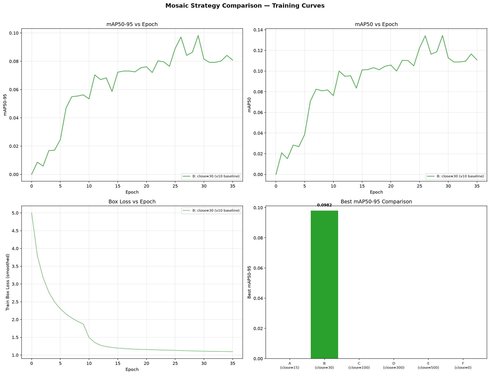
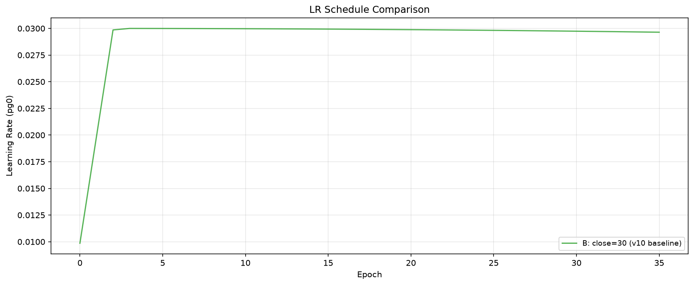

# Mosaic 调度策略对比基准测试报告

**生成时间**: 2026-06-29 16:55:19

---

## 1. 实验概述

| 方案 | close_mosaic | 含义 | 实验名 | 状态 |
|------|-------------|------|--------|------|
| A | 15 | 方案A: 早期关闭 (close_mosaic=15) | exp_mosaic_A_close15 | ❌ 未开始 |
| B | 30 | 方案B: v10基线 (close_mosaic=30) | exp1_focal_v10 | ✅ 完成 |
| C | 100 | 方案C: 中期关闭 (close_mosaic=100) | exp_mosaic_C_close100 | ❌ 未开始 |
| D | 300 | 方案D: 晚期关闭 (close_mosaic=300) | exp_mosaic_D_close300 | ❌ 未开始 |
| E | 500 | 方案E: 等价永不关闭 (close_mosaic=500) | exp_mosaic_E_close500 | ❌ 未开始 |
| F | 0 | 方案F: 永不关闭 (close_mosaic=0) | exp_mosaic_F_never | ❌ 未开始 |

## 2. 整体指标对比

| 方案 | close_mosaic | Best Epoch | mAP50 | mAP50-95 | Precision | Recall | 训练时间(h) |
|------|-------------|------------|-------|----------|-----------|--------|------------|
|  **B** | 30 | 30 | 0.1344 | 0.0982 (基准) | 0.43846 | 0.2197 | 3261.31 |

### 排名

| 排名 | 方案 | close_mosaic | mAP50-95 | 相对基准 |
|------|------|-------------|----------|----------|
| 1 | ⭐⭐⭐⭐⭐ B | 30 | 0.0982 | +0.0000 |

## 3. Loss 对比

| 方案 | Final Box Loss | Final Cls Loss | Final DFL Loss | Final Angle Loss |
|------|---------------|---------------|---------------|------------------|
| B | 1.08532 | 0.1445 | 1.02734 | 0.03381 |

## 4. 分析结论

### 最佳策略: B (close_mosaic=30)

- mAP50-95: **0.0982**
- 最佳 epoch: 30

### 推荐训练策略

★★★★★ **推荐方案**: close_mosaic=30

理由: mAP50-95 最高 (0.0982)

## 5. 图表

### 训练曲线

### 学习率曲线

---

*报告由 benchmark_mosaic.py 自动生成*
