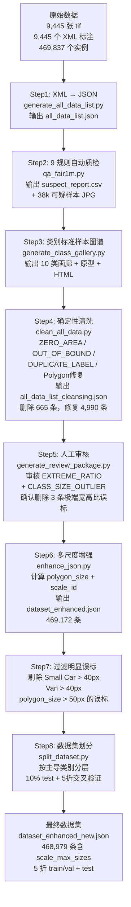

# 遥感街景车辆检测数据集说明文档

> 版本：v2.0 | 生成日期：2026-06-27
> 数据来源：FAIR1M 遥感影像标注数据集 | 核心文件：`dataset_enhanced_new.json`

---

## 一、数据集背景

### 1.1 建设背景

本数据集源自 FAIR1M 百万级遥感细粒度目标检测数据集，原始标注采用 FAIR1M 标准格式（XML + OBB 定向旋转框）。FAIR1M 是中国科学院空天信息创新研究院发布的遥感影像目标检测基准数据集，面向任意方向目标的精细化检测任务。

在此基础上，我们对原始数据进行了**系统性清洗、增强和多尺度划分**，形成了一套可直接用于模型训练的高质量车辆检测数据集。

### 1.2 数据来源

- **影像来源**：高分辨率光学遥感影像（4 波段：RGB + NIR），其中第 4 波段（NIR/Alhpa）恒为 255，实际可用为 RGB 三通道
- **传感器类型**：Optical（光学传感器）
- **标注来源**：FAIR1M 数据集细粒度车辆类别标注
- **标注格式**：OBB（Oriented Bounding Box）4 点定向旋转矩形

### 1.3 应用场景

- 遥感影像中的城市交通监控与车辆检测
- 港口、机场、停车场等场景的车辆类型识别
- 大规模遥感图像分析与情报提取
- 多尺度、小目标、密集场景下的目标检测研究

### 1.4 面向研究任务

本数据集面向旋转目标检测（Oriented Object Detection）任务，尤其关注多尺度、长尾类别和密集场景下的车辆检测。适用于训练和评估 OBB 检测模型（如 Oriented R-CNN、Rotated RetinaNet、YOLO-OBB 等）。

### 1.5 相比公开数据集的特点

| 特性 | 本数据集 | 公开 FAIR1M 原始数据 |
|---|---|---|
| 标注精度 | 经过 9 条规则质检 + 确定性清洗 + 人工审核 | 原始标注，存在噪声 |
| 多尺度支持 | 内置 polygon_size + scale_id 四档尺度划分 | 无尺度标注 |
| 数据划分 | 5 折交叉验证，按主导类别分层，图片级不重叠 | 需自行划分 |
| 可直接训练 | 是，JSON 仅保留 5 个必要字段 | 需预处理 |
| 类别图谱 | 附分层抽样类别标准样本图谱 + 原型样本 | 无 |
| 质检报告 | 完整 9 规则质检报告 + 可疑样本可视化 | 无 |

---

## 二、数据集总体介绍

### 2.1 基本规模

| 指标 | 数值 |
|---|---|
| 标注图像总数 | 9,442（去重后） |
| 总实例数 | 468,979（清洗增强后） |
| 平均每张图实例数 | 49.69 |
| 实例数中位数 | 31 |
| 实例数范围 | 1 ~ 1,074 |
| 图像通道 | 4 波段（RGB + NIR/Alpha），实际使用 [:, :, :3] |

### 2.2 图像尺寸分布

| 尺寸 | 数量 | 占比 |
|---|---|---|
| 1000 × 1000 | 4,098 | 43.40% |
| 600 × 800 | 2,674 | 28.32% |
| 800 × 600 | 2,666 | 28.24% |
| 1500 × 1500 | 3 | 0.03% |

### 2.3 数据类型

- 遥感高分辨率光学影像（tif 格式，uint8）
- OBB（Oriented Bounding Box）定向旋转矩形标注
- 10 类细粒度车辆类别
- 内置多尺度标注（polygon_size + scale_id）

---

## 三、标注说明

### 3.1 标注类型

本数据集采用 **OBB（Oriented Bounding Box）4 点定向旋转矩形**标注，以精确框住任意方向的遥感车辆目标。

### 3.2 最终 JSON 标注格式

每条标注实例包含 **5 个字段**：

```json
{
  "data_path": "/absolute/path/to/xxx.tif",
  "lab": "Van",
  "points": [
    [424.0, 195.0],
    [419.0, 200.0],
    [407.0, 191.0],
    [412.0, 186.0],
    [424.0, 195.0]
  ],
  "polygon_size": 18.54,
  "scale_id": 1
}
```

| 字段 | 类型 | 说明 |
|---|---|---|
| `data_path` | string | tif 遥感影像的绝对路径 |
| `lab` | string | 类别名称（共 10 类） |
| `points` | array[5][2] | OBB 四边形顶点，5 个点首尾重合（顺时针），取前 4 个点构成旋转矩形 |
| `polygon_size` | float | OBB 最长边长度（px），是目标空间尺度的度量 |
| `scale_id` | int | 基于 polygon_size 的尺度分级（0 ~ 3） |

**关键约定**：
- 最终 JSON **仅允许这 5 个字段**。面积、宽高比、旋转角等中间计算量一律不保留，避免下游模型误用
- polygon_size 是 OBB 最长边，不是面积
- points 为 5 个点，首尾重复，取 `points[:4]` 得到实际四边形
- 数据已经过清洗：零面积、越界、重复标注、极端宽高比误标均已移除

### 3.3 Polygon 说明

- **顶点顺序**：顺时针排列
- **闭合方式**：第 5 个点与第 1 个点相同，用于闭合矩形
- **坐标格式**：像素坐标（float）
- **方向支持**：支持任意旋转角度目标的精准框定

### 3.4 类别列表

| 序号 | 类别名称 | 中文含义 | 数量 | 占比 | 典型 polygon_size (px) |
|---|---|---|---|---|---|
| 1 | Small Car | 小汽车 | 206,508 | 44.02% | 15 ~ 21 |
| 2 | Van | 面包车 | 200,172 | 42.68% | 15 ~ 20 |
| 3 | Dump Truck | 自卸卡车 | 33,837 | 7.21% | 19 ~ 28 |
| 4 | Cargo Truck | 货车 | 15,122 | 3.22% | 25 ~ 45 |
| 5 | other-vehicle | 其他车辆 | 6,352 | 1.35% | 15 ~ 28 |
| 6 | Bus | 公交车 | 1,496 | 0.32% | 28 ~ 45 |
| 7 | Truck Tractor | 牵引车 | 1,292 | 0.28% | 18 ~ 40 |
| 8 | Excavator | 挖掘机 | 1,215 | 0.26% | 22 ~ 42 |
| 9 | Trailer | 拖车 | 799 | 0.17% | 28 ~ 48 |
| 10 | Tractor | 拖拉机 | 288 | 0.06% | 18 ~ 38 |

> 注：占比指在清洗后的 enhanced_new.json（468,979 条）中的比例。Small Car + Van 占比约 87%，呈现明显的头部集中和长尾分布。

### 3.5 尺度定义（Scale）

#### 3.5.1 polygon_size 计算规则

**polygon_size = OBB（最小外接旋转矩形）的最长边**。

计算方法：
1. 取 polygon 前 4 个顶点，计算两组对边的平均长度
2. width = min(side_a, side_b)，height = max(side_a, side_b)
3. polygon_size = height（最长边）

**为什么用 OBB 最长边而不是面积？**
- 滑动窗口尺寸由目标在图像上的空间跨度决定，最长边直接对应目标占用的像素跨度
- 面积无法区分"细长目标"和"方正目标"——一个 Bus（细长，空间跨度大）和一个 Excavator（方正，跨度适中），面积可能相近但需要的窗口尺寸不同
- 用最长边作为滑动窗口的参考尺寸，保证目标在任何旋转角度下都能被窗口覆盖

#### 3.5.2 Scale 划分表

阈值配置（config.yaml）：[12, 18, 28]

| scale_id | 范围 (polygon_size) | 滑动窗口尺寸 | 数量 | 占比 | 主要覆盖 |
|---|---|---|---|---|---|
| 0 | 0 ~ 12 px | 12 px | 11,038 | 2.4% | 极小目标 / 远距离小汽车 |
| 1 | 12 ~ 18 px | 18 px | 200,617 | 42.8% | Small Car, Van 主体 |
| 2 | 18 ~ 28 px | 28 px | 238,853 | 50.9% | Small Car, Van, Dump Truck |
| 3 | 28 ~ 50 px | 50 px | 16,573 | 3.5% | Cargo Truck, Bus, Trailer |

#### 3.5.3 划分依据

1. **数据驱动**：基于全局 polygon_size 分布（P25=15、P50=18、P75=21），12/18/28 分别对应极小目标边界、Small Car 中位数附近、大目标的起始点
2. **Scale 1 和 Scale 2 承载 94% 的样本**，恰好覆盖 Small Car 和 Van 两个主力类别的正常尺寸范围
3. **Scale 3 承载大目标**：Cargo Truck、Bus、Trailer 的均值在 30~40 px，≥28 的阈值将它们与小目标分开，避免 anchor 混淆
4. **Scale 0 为边界极小目标预留**：12 px 以下的远距离小目标单独处理
5. **可配置**：修改 `config.yaml` 中的 thresholds 即可重新划分 Scale，无需改动代码

#### 3.5.4 各 Scale 类别组成

| Scale | Small Car | Van | Dump Truck | Cargo Truck | other-vehicle | Bus | Truck Tractor | Excavator | Trailer | Tractor |
|---|---:|---:|---:|---:|---:|---:|---:|---:|---:|---:|
| 0 | 4,768 | 5,460 | 176 | 170 | 432 | 4 | 5 | 16 | 4 | 3 |
| 1 | 91,236 | 100,641 | 4,253 | 1,836 | 2,287 | 48 | 130 | 104 | 46 | 36 |
| 2 | 109,798 | 92,713 | 26,035 | 5,831 | 2,791 | 228 | 736 | 403 | 156 | 162 |
| 3 | 721 | 1,407 | 3,456 | 8,423 | 940 | 1,397 | 479 | 765 | 978 | 98 |

---

## 四、数据属性

本数据集具有以下显著属性：

| 属性 | 程度 | 说明 |
|---|---|---|
| 高分辨率 | 中 | 1000×1000 / 800×600 / 600×800 遥感影像 |
| 小目标占比高 | 高 | 中位数面积仅 144.5 px²，43% 目标 polygon_size < 18 px |
| 长尾类别分布 | 严重 | Small Car + Van 占 87%，Tractor 仅 288 个 (0.06%) |
| 多尺度目标 | 明显 | polygon_size 范围 2.85 ~ 266.61 px，跨度达 93 倍 |
| 密集目标 | 高 | 最多单图 1,074 个目标，平均 49.7 个/图 |
| 旋转目标 | 全部 | 100% 为 OBB 标注，旋转角 0°~45° |
| Polygon 标注 | 全部 | 4 点定向旋转框，首尾闭合 |
| 类内差异 | 大 | Cargo Truck 变异系数 0.886，面积极差达 24,000 px² |
| 类间相似 | 存在 | Small Car vs Van 面积和宽高比分布高度重叠 |
| 空间均衡 | 良好 | 四象限分布均匀（各约 25%），边界区域占比 < 10% |

---

## 五、数据处理流程

### 5.1 总流程



### 5.2 每一步详细说明

| 步骤 | 脚本 | 输入 | 输出 | 关键成果 |
|---|---|---|---|---|
| 1. XML→JSON | `generate_all_data_list.py` | `gt/*.xml` + `lab_list.txt` | `all_data_list.json` | 469,837 条 |
| 2. 自动质检 | `qa_fair1m.py` | `all_data_list.json` | `output/` 质检报告 | 30,086 条疑标 (6.40%) |
| 3. 类别图谱 | `generate_class_gallery.py` | `all_data_list.json` | `output/class_gallery/` | 10 类画廊 + 原型 |
| 4. 确定性清洗 | `clean_all_data.py` | `all_data_list.json` | `all_data_list_cleansing.json` | 删除 662，修复 4,990 |
| 5. 人工审核 | `generate_review_package.py` | `all_data_list.json` | `output/` 审核包 | CLASS_SIZE_OUTLIER 2,569 + EXTREME_RATIO 26 |
| 6. 多尺度增强 | `enhance_json.py` | 清洗后 JSON + config.yaml | `dataset_enhanced.json` | 含 polygon_size + scale_id |
| 7. 误标过滤 | 手动规则 | `dataset_enhanced.json` | `dataset_enhanced_new.json` | 468,979 条 |
| 8. 数据划分 | `split_dataset.py` | `dataset_enhanced_new.json` | `fold_0~4/` + `test.json` | 5 折交叉验证 |

---

## 六、数据清洗策略

### 6.1 自动质检（9 条规则）

| # | 规则 | 判定条件 | 阈值/方法 | 检出数量 |
|---|---|---|---|---|
| 1 | ZERO_AREA | 面积 ≤ 0 | — | 167 |
| 2 | SMALL_OBJECT | 面积 < P1 或 < 4 px² | P1 = 62.5 px² | 4,657 |
| 3 | LARGE_OBJECT | 面积 > P99 | P99 = 488.0 px² | 4,689 |
| 4 | EXTREME_RATIO | 长边/短边 > 10 | — | 26 |
| 5 | OUT_OF_BOUND | 顶点超出图像范围 | — | 1,932 |
| 6 | SELF_INTERSECTION | 四边形自相交 | Shapely 判定 | 0 |
| 7 | DUPLICATE_LABEL | 同类 IoU > 0.95 | — | 638 |
| 8 | CLASS_SIZE_OUTLIER | Area 超出 Mean ± 3Std | 按类别计算 | 2,492 |
| 9 | ANOMALY_IF | IsolationForest 异常检测 | contamination=0.05 | 23,492 |

> 自动质检共检出 30,086 条疑标（占总量 6.40%），其中 ANOMALY_IF 和 SMALL_OBJECT/LARGE_OBJECT 占大部分。

### 6.2 确定性清洗（6 步）

| Step | 规则 | 操作 | 条件 | 处理数量 |
|---|---|---|---|---|
| 1 | ZERO_AREA | 删除 | Area ≤ 0 | 167 |
| 2 | OUT_OF_BOUND | Clip 修复 | 坐标裁剪到图像边界 | 4,986 |
| 3 | OUT_OF_BOUND_TOO_SMALL | 删除 | 修复后 Area < 4 px² | 176 |
| 4 | DUPLICATE_LABEL | 删除（保留大面积者） | 同类 IoU > 0.95 | 319 |
| 5 | POLYGON_NORMALIZED | 补齐 | 点数不足 5 或首尾不一致 | 0 |
| 6 | POINT_ORDER_FIXED | 反转 | 逆时针 → 顺时针 | 4 |

> 确定性清洗共删除 662 个目标，修复 4,990 个目标，保留率 99.86%。

### 6.3 人工审核清洗

- **CLASS_SIZE_OUTLIER**：审核 2,569 个尺寸异常目标，针对明显错标类别（如 Small Car 面积超过 40 px、Van 超过 40 px 通常为误分类或标注错误）进行删除或修正
- **EXTREME_RATIO**：审核 26 个极端宽高比目标（AR > 10），确认并删除 3 个误标
- **误标过滤**：清洗后若 Small Car polygon_size > 40 px、Van polygon_size > 40 px、polygon_size > 50 px，判定为误标并删除

### 6.4 清洗汇总

| 阶段 | 操作 | 删除数 | 修复数 |
|---|---|---|---|
| 确定性清洗 | ZERO_AREA + OUT_OF_BOUND + DUPLICATE | 662 | 4,990 |
| 人工审核 | EXTREME_RATIO 确认 | 3 | — |
| 误标过滤 | Small Car > 40 / Van > 40 / size > 50 | 约 190 | — |
| **总计** | — | **~855** | **4,990** |
| | | **原始 469,837 → 最终 468,979** | |

---

## 七、数据统计结果

### 7.1 类别分布

| 类别 | 数量 | 占比 | 累计占比 |
|---|---|---|---|
| Small Car（小汽车） | 206,508 | 44.02% | 44.02% |
| Van（面包车） | 200,221 | 42.68% | 86.69% |
| Dump Truck（自卸卡车） | 33,837 | 7.21% | 93.90% |
| Cargo Truck（货车） | 15,122 | 3.22% | 97.12% |
| other-vehicle（其他车辆） | 6,352 | 1.35% | 98.47% |
| Bus（公交车） | 1,496 | 0.32% | 98.79% |
| Truck Tractor（牵引车） | 1,292 | 0.28% | 99.07% |
| Excavator（挖掘机） | 1,215 | 0.26% | 99.33% |
| Trailer（拖车） | 799 | 0.17% | 99.50% |
| Tractor（拖拉机） | 288 | 0.06% | 100.00% |

### 7.2 全局几何特征

| 指标 | Min | P5 | P25 | P50 | P75 | P95 | Max | Mean |
|---|---|---|---|---|---|---|---|---|
| 面积 (px²) | 4.0 | 85.0 | 120.0 | 144.5 | 175.5 | 261.0 | 39733.5 | 158.0 |
| 短边 (px) | 0.5 | 5.9 | 7.0 | 8.0 | 9.0 | 11.0 | 143.3 | 8.1 |
| 长边 (px) | 2.9 | 13.0 | 16.1 | 18.2 | 20.9 | 26.5 | 306.0 | 19.1 |
| 宽高比（短边/长边） | 0.0 | 0.3 | 0.4 | 0.4 | 0.5 | 0.6 | 1.0 | 0.4 |
| 旋转角 (°) | 0.0 | 0.0 | 3.2 | 13.5 | 28.3 | 41.4 | 45.0 | 16.5 |

### 7.3 面积方差与离散度

| 类别 | 样本数 | 均值 | 标准差 | 变异系数 |
|---|---|---|---|---|
| Small Car | 206,508 | 146.3 | 97.8 | 0.668 |
| Van | 200,221 | 140.7 | 43.6 | 0.310 |
| Dump Truck | 33,837 | 203.8 | 89.8 | 0.441 |
| Cargo Truck | 15,122 | 330.1 | 292.6 | **0.886** |
| other-vehicle | 6,352 | 190.3 | 136.6 | 0.718 |
| Bus | 1,496 | 405.0 | 153.7 | 0.379 |
| Truck Tractor | 1,292 | 273.2 | 169.0 | 0.618 |
| Excavator | 1,215 | 407.1 | 243.3 | 0.598 |
| Trailer | 799 | 494.2 | 246.6 | 0.499 |
| Tractor | 288 | 321.0 | 267.6 | **0.834** |

### 7.4 宽高比对比（中位数）

| 狭长型目标 | 中位数宽高比 | 近似长宽比 | 方正型目标 | 中位数宽高比 | 近似长宽比 |
|---|---|---|---|---|---|
| Trailer | 0.254 | 3.9:1 | Dump Truck | 0.407 | 2.5:1 |
| Bus | 0.272 | 3.7:1 | Van | 0.438 | 2.3:1 |
| Truck Tractor | 0.331 | 3.0:1 | Small Car | 0.439 | 2.3:1 |
| Cargo Truck | 0.351 | 2.8:1 | | | |

### 7.5 空间位置分布

全局目标中心均匀分布于图像四象限（各约 25%），无显著空间偏置。

### 7.6 每张图实例数分布

| 区间 | 图像数 | 占比 |
|---|---|---|
| 1 ~ 5 | 1,031 | 10.92% |
| 6 ~ 10 | 883 | 9.35% |
| 11 ~ 20 | 1,525 | 16.15% |
| 21 ~ 50 | 2,842 | 30.10% |
| 51 ~ 100 | 1,864 | 19.74% |
| 101 ~ 200 | 1,063 | 11.26% |
| 201 ~ 500 | 224 | 2.37% |
| 501+ | 10 | 0.11% |

---

## 八、数据集划分

### 8.1 划分方案

采用 **5 折交叉验证 + 固定 test 集** 方案：

- **Test 集**：10% 图片（按主导类别分层抽样，固定不变）
- **剩余 90%** 均分为 5 折，每折中 1 份作为 val（对应 Scale 均衡的验证集），4 份作为 train

### 8.2 划分原则

1. **以图片为单位划分**：同一张图片的所有标注归入同一集合，避免数据泄漏
2. **按主导类别分层**：每张图以数量最多的类别作为主导类别，按主导类别分层抽样
3. **固定 test 集**：10% test 在所有 fold 间保持不变，确保评估一致性
4. **val 互不重叠**：各 fold 的 val 之间互不重叠，覆盖全部训练图片
5. **类别全覆盖**：每个 fold 的 train 和 val 均包含全部 10 类

### 8.3 各集合标注数量

| 集合 | 标注数 | 图片数 | 占比 |
|---|---|---|---|
| Test | 47,549 | ~944 | 10% |
| Train（每折） | ~335,000 ~ 338,000 | ~7,554 | ~72% |
| Val（每折） | ~83,000 ~ 86,000 | ~1,888 | ~18% |

---

## 九、对应研究任务

本数据集适用于以下研究任务：

### 9.1 旋转目标检测（Oriented Object Detection）
- 100% OBB 标注，支持任意方向旋转框检测
- 适用于 Oriented R-CNN、Rotated RetinaNet、S²A-Net 等模型

### 9.2 多尺度目标检测（Multi-Scale Object Detection）
- 内置 4 档 scale_id，可直接进行多尺度训练
- polygon_size 跨度 93 倍（2.85 ~ 266.61 px），覆盖从极远距离小汽车到大型拖车的全尺度谱
- 支持按 scale_id 分组训练、多滑窗尺寸策略

### 9.3 小目标检测（Small Object Detection）
- Scale 0（< 12 px）+ Scale 1（12 ~ 18 px）占 45%，大量小目标
- 中位数面积仅 144.5 px²，在 1000×1000 影像中占比极小

### 9.4 长尾/类别不平衡学习（Long-Tailed / Imbalanced Learning）
- 10 类呈严重长尾分布：Small Car (44%) + Van (43%) vs Tractor (0.06%)
- 训练比（最频繁/最稀少）超过 700:1
- 适用于类别加权 loss、oversampling、few-shot 方法研究

### 9.5 数据集构建与质量评估（Dataset Construction & QA）
- 完整 9 条规则质检流水线可作为数据集质量评估范本
- 清洗前后的对比分析支持数据质量研究

### 9.6 密集场景目标检测（Dense Object Detection）
- 单图最多 1,074 个目标，平均 49.7 个/图
- 适合研究密集场景下的 NMS、anchor 分配等问题

---

## 十、重点与难点分析

### 10.1 数据特点

| 特点 | 详细说明 |
|---|---|
| **极端类别不均衡** | Small Car + Van 占 87%，Tractor/Trailer/Excavator 等尾类合计不足 1% |
| **尺度跨度极大** | polygon_size 2.85 ~ 266.61 px，跨 2 个数量级 |
| **密集场景** | 30% 的图片有 21~50 个目标，11% 的图片有 101~200 个目标 |
| **类间尺寸重叠** | Small Car 和 Van 的 polygon_size 几乎完全重叠（均值差不到 0.4 px），仅凭尺寸难以区分 |
| **宽高比差异显著** | Bus/Trailer（AR 约 3.7~3.9:1）与 Excavator/Dump Truck（AR 约 2.5:1）形态差异大 |

### 10.2 标注难点

| 难点 | 说明 |
|---|---|
| **小目标边界模糊** | polygon_size < 12 px 的目标，几个像素的标注偏差即可导致面积显著变化 |
| **密集目标区分** | 停车场等场景目标密集排列，边界难以清晰划分 |
| **旋转角度多样化** | 旋转角 0°~45° 均匀分布，部分目标方向与道路走向不严格一致 |
| **类别混淆** | Small Car vs Van 外观和尺寸高度相似，标注一致性有挑战 |

### 10.3 算法难点

| 难点 | 原因分析 |
|---|---|
| **小目标召回率** | Scale 0 (≤ 12 px) 仅占 2.4%，特征图下采样后信息严重丢失 |
| **多尺度检测** | 大目标 (polygon_size > 50 px) 和小目标 (≤ 12 px) 在同一特征层上难以同时处理 |
| **长尾类别学习** | Tractor 仅 288 个样本，模型容易忽略或过度自信地将其归为 Small Car |
| **滑窗尺寸选择** | 单一滑窗无法覆盖尺度谱，需要多尺度滑窗或多级特征金字塔 |
| **NMS 误检消除** | 密集场景下 IoU 阈值难以设定，过高则漏检，过低则误检 |
| **旋转框回归** | OBB 的角度周期性（边界 0°/90°）导致回归不稳定 |

---

## 十一、数据集优势

1. **精细 OBB 标注**：4 点定向旋转矩形，精确框住任意方向目标，避免水平框的背景噪声
2. **内置多尺度体系**：polygon_size + scale_id 为多尺度训练和滑窗策略提供直接支撑，模型无需再计算几何属性
3. **完整质量清洗**：9 条规则自动质检 + 6 步确定性清洗 + 人工审核，确保标注一致性
4. **清洗程度透明**：每步清洗均有详细统计报告，删除和修复量公开可追溯
5. **可直接训练**：JSON 仅保留 5 个必要字段，DataLoader 开箱即用
6. **类别原型参考**：附分层抽样类别标准样本图谱 + 原型样本，便于理解标注规范
7. **5 折交叉验证**：按主导类别分层 + 图片级不重叠 + 类别全覆盖，评估可靠
8. **可配置 Scale**：修改 config.yaml 即可重新划分尺度，适配不同任务需求
9. **像素坐标精确**：标注坐标使用浮点精度，保留亚像素精度信息

---

## 十二、使用指南

### 12.1 加载数据

```python
import json
with open("dataset_enhanced_new.json") as f:
    dataset = json.load(f)

scale_max = dataset["scale_max_sizes"]  # {"0": 12.0, "1": 18.0, "2": 28.0, "3": 50.0}
annotations = dataset["data"]
```

### 12.2 按 Scale 分组训练

```python
by_scale = {}
for ann in annotations:
    sid = str(ann["scale_id"])
    by_scale.setdefault(sid, []).append(ann)

for sid, anns in by_scale.items():
    window_size = int(scale_max[sid])
    # 以 window_size × window_size 做滑动窗口检测
```

### 12.3 读取图像与 Polygon

```python
import cv2
import numpy as np

img = cv2.imread(ann["data_path"], cv2.IMREAD_UNCHANGED)
img = img[:, :, :3]  # 取前 3 波段 (RGB)
if img.dtype == np.uint16:
    img = (img / 256).astype(np.uint8)

pts = np.array(ann["points"][:4])  # 取前 4 个点
```

### 12.4 核心文件清单

| 文件 | 说明 | 条目数 |
|---|---|---|
| `dataset_enhanced_new.json` | **主力训练文件**，含 scale_max_sizes | 468,979 |
| `test.json` | 固定测试集 | 47,549 |
| `fold_0~4/train.json` | 各折训练集 | ~335,000 ~ 338,000 |
| `fold_0~4/val.json` | 各折验证集 | ~83,000 ~ 86,000 |
| `config.yaml` | Scale 阈值配置 | — |
| `清洗中间文件/dataset_specification.md` | 数据结构与设计说明 | — |
| `清洗中间文件/数据集分布统计报告.md` | 全量分布统计 | — |
| `清洗中间文件/scale_analysis.md` | Scale 划分分析报告 | — |

---

## 附录：数据集构建总结

本数据集从 FAIR1M 原始 XML 标注出发，经历了**数据整合 → 自动质检 → 类别理解 → 确定性清洗 → 人工审核 → 多尺度增强 → 数据划分**的完整构建流程。

**主要成果**：

1. **468,979 条高质量标注**：原始 469,837 条经过系统清洗后，删除了 855 条存在问题的标注（零面积、越界、重复、极端误标），修复了 4,990 条越界顶点和方向不一致的 Polygon
2. **5 字段最小化设计**：data_path / lab / points / polygon_size / scale_id，杜绝信息冗余和下游误用
3. **4 档多尺度体系**：基于 polygon_size（OBB 最长边）的数据驱动尺度划分，覆盖 2.85 ~ 266 px 的全尺度谱
4. **5 折交叉验证**：按主导类别分层 + 图片级不重叠 + 类别全覆盖，为模型评估提供严谨的划分方案
5. **完整质量追溯**：每一步清洗/增强均有量化统计报告，数据质量透明可控
6. **辅助工具齐全**：质检报告、类别图谱、人工审核系统、多尺度分析报告等配套工具可直接复用

**构建周期**：2026-06-18 至 2026-06-27，经过 Todo_00 ~ Todo_04 五个阶段的迭代优化，最终形成可直接用于多尺度旋转车辆检测训练的高质量数据集。
